# GCP Multi-Tier Application Infrastructure

[](https://www.terraform.io/)
[](https://cloud.google.com/)
[](https://cloud.google.com/build)

---

## 🚀 Project Overview

This project delivers a **production-grade, modular Infrastructure as Code (IaC) solution** for deploying a secure, scalable, and highly available multi-tier application on Google Cloud Platform using Terraform. It demonstrates best practices in cloud architecture, automation, and security—making it ideal for real-world enterprise workloads and a strong showcase for recruiters and technical reviewers.

---

## 🏗️ Architecture Overview

The infrastructure is designed for reliability, scalability, and security:
- **Custom VPC** with segmented subnets for frontend, application, and database tiers
- **Managed Instance Groups** for each tier, using startup scripts for automation
- **Global HTTP(S) Load Balancer** for high availability and traffic distribution
- **Fine-grained Firewall Rules** and IAM bindings for robust security
- **Cloud NAT** for secure internet access from private subnets

**Architecture Diagram:**

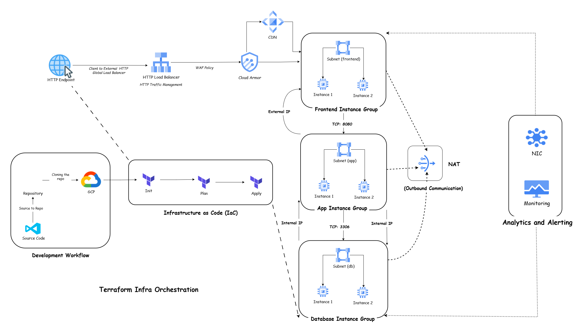

---

## 📁 Project Structure

```
gcp-multitier-app/
├── architecture/                # Architecture diagrams
│   └── architecture.jpg
├── screenshots/                 # Step-by-step implementation screenshots
│   ├── 01_github_authentication.png
│   ├── 02_github_repo_cloning_tf_scripts.png
│   └── ...
├── modules/                     # Terraform modules (compute, network, loadbalancer, security)
├── scripts/                     # Startup scripts for each tier
├── main.tf                      # Root Terraform configuration
├── variables.tf                 # Input variables
├── outputs.tf                   # Output values
├── providers.tf                 # Provider configuration
├── backend.tf                   # Remote state backend
├── terraform.tfvars             # Variable values for deployment
└── README.md                    # Project documentation
```

---

## 📸 Implementation Walkthrough

Each step of the project is documented with screenshots and concise explanations:

### 1️⃣ GitHub Authentication in gcloud CLI
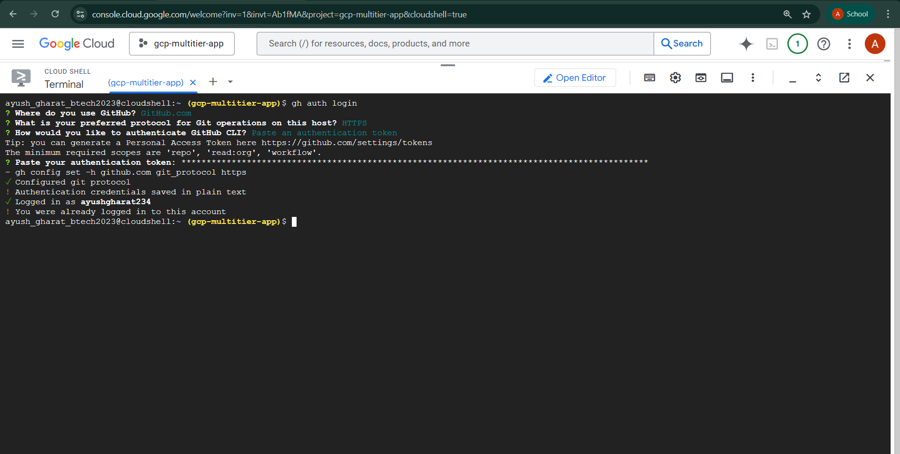
- **Purpose:** Secure authentication for CI/CD and cloud automation.

### 2️⃣ Cloning Terraform Scripts from GitHub
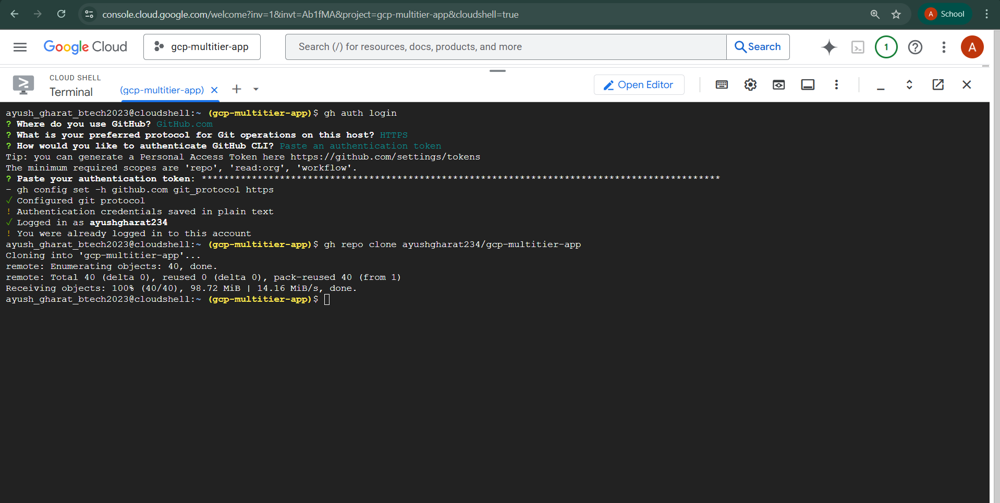
- **Purpose:** Version control and reproducibility.

### 3️⃣ Configuring Variables and Self Links
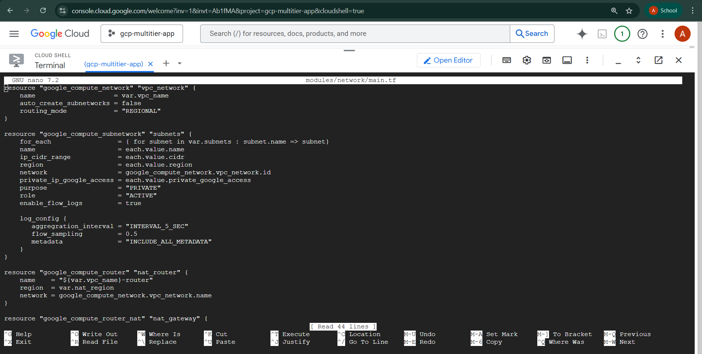
- **Purpose:** Parameterization for flexible deployments.

### 4️⃣ Creating Bucket for Terraform State Files
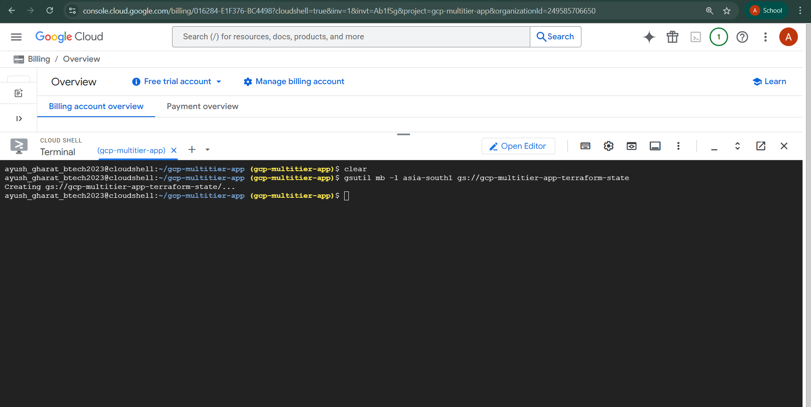
- **Purpose:** Remote state management for team collaboration.

### 5️⃣ Initializing Terraform
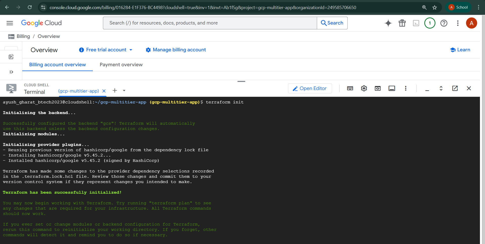
- **Purpose:** Provider and backend initialization.

### 6️⃣ Enabling Required APIs
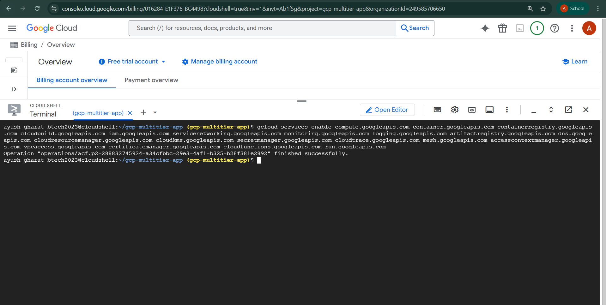
- **Purpose:** API enablement for resource provisioning.

### 7️⃣ Running VM Instances
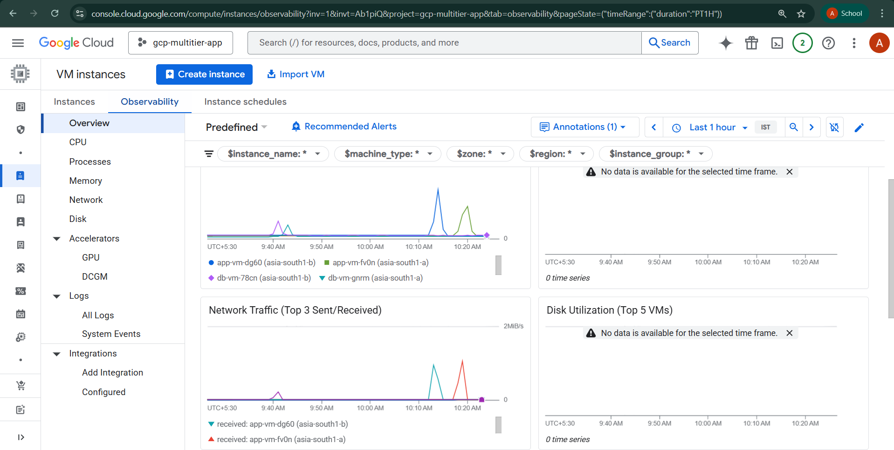
- **Purpose:** Automated compute provisioning with Managed Instance Groups.

### 8️⃣ Custom Firewall Rules
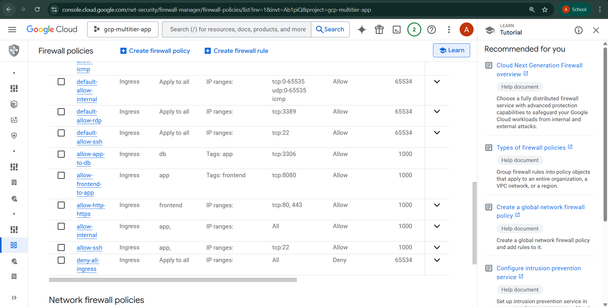
- **Purpose:** Secure, least-privilege network access.

### 9️⃣ NIC Network Analysis
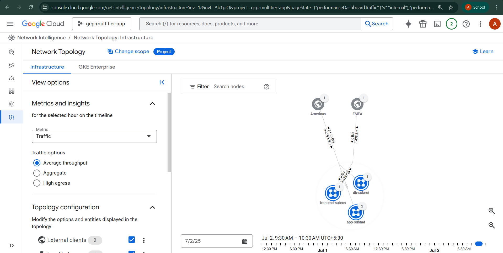
- **Purpose:** Network segmentation and security validation.

### 🔟 Instance Network Topology
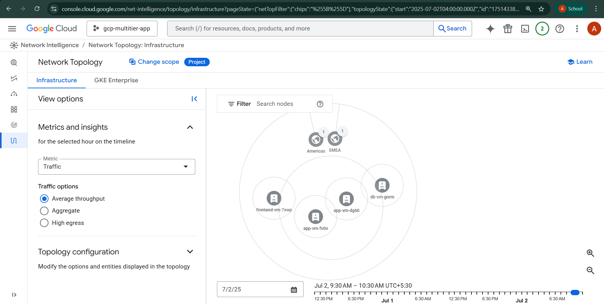
- **Purpose:** Visualizing and verifying instance connectivity.

### 1️⃣1️⃣ Frontend Load Balancer Topology
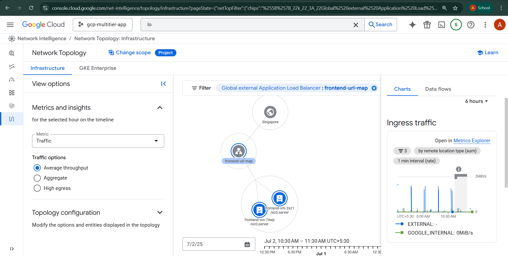
- **Purpose:** High availability and traffic distribution.

### 1️⃣2️⃣ NIC Connectivity Test: Frontend to App
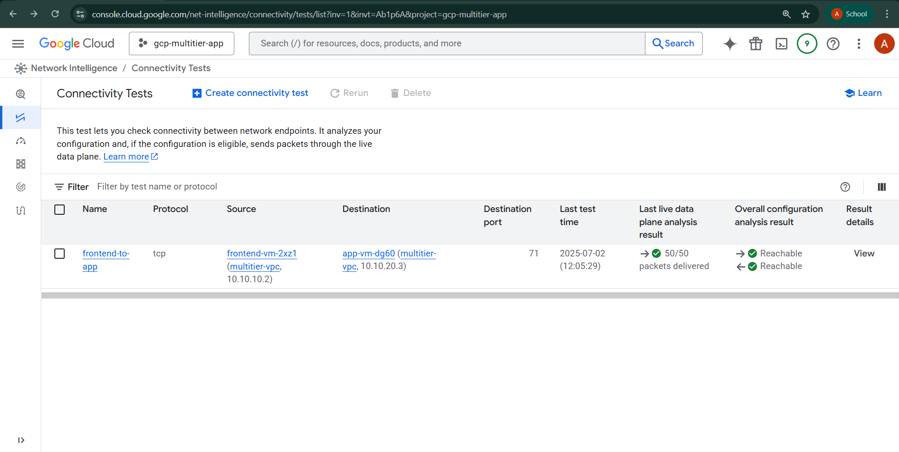
- **Purpose:** Verifying secure, functional inter-tier connectivity.

---

## ⚡ Quick Start

1. **Clone the repository**
   ```sh
   git clone <repo-url>
   cd gcp-multitier-app
   ```
2. **Configure variables**
   - Edit `terraform.tfvars` for your project and network settings.
3. **Initialize Terraform**
   ```sh
   terraform init
   ```
4. **Plan the deployment**
   ```sh
   terraform plan
   ```
5. **Apply the configuration**
   ```sh
   terraform apply
   ```
6. **Access the Application**
   - The output will display the load balancer's external IP. Open it in your browser.

---

## 🔍 Verification Commands

- **Check VPCs and Subnets**
  ```sh
  gcloud compute networks list
  gcloud compute networks subnets list
  ```
- **Check Compute Instances**
  ```sh
  gcloud compute instances list
  ```
- **Check Firewall Rules**
  ```sh
  gcloud compute firewall-rules list
  ```
- **Check IAM Permissions**
  ```sh
  gcloud projects get-iam-policy <YOUR_PROJECT_ID>
  ```

---

## 🧹 Clean Up

To destroy all resources:
```sh
terraform destroy
```

---

## 🤝 Contributing

1. Fork the repository
2. Create a feature branch (`git checkout -b feature/amazing-feature`)
3. Commit your changes (`git commit -m 'Add some amazing feature'`)
4. Push to the branch (`git push origin feature/amazing-feature`)
5. Open a Pull Request

---

## 📝 License

This project is licensed under the MIT License. See the [LICENSE](LICENSE) file for details.

---

## 🆘 Support

If you encounter any issues or have questions:
- Check the [Issues](../../issues) page
- Review the documentation
- Create a new issue with detailed information

---

**Note:** All screenshots and architecture diagrams are for documentation and demonstration purposes. For actual infrastructure deployment, use the provided Terraform modules and scripts. 